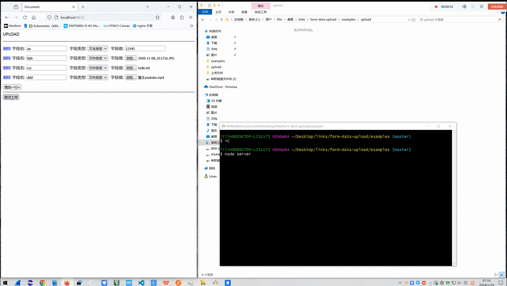

# 基于传输层实现http文件接收    

做web这么些年，有没有好奇过文件上传是如何传输的，服务器端又是如何接收的？   

本篇将使用 `NODEJS` 基于传输层，手撸http服务器的部分实现，和上层的 http `multipart/form-data` 报文（文件）接收处理。      

> 个人的理解，http是个非常庞大的协议，不是说协议结构有多复杂(本篇讨论范围是版本1.0-1.1)，而是运作时候各种因果条件非常的多且互相乃至交叉作用。       
> 有关它的书籍几乎大多都是砖头书，本人经常是把他当做字典来查。         
> **本篇基于tcp实现的http服务，只实现满足可以支撑实现上层文件接收的这个程度。**          

**📑 本篇章节目录：**   


* [从TCP实现HTTP服务器](#从TCP实现HTTP服务器)    
* [文件接收原理](#文件接收原理)   
* [文件接收的代码实现](#文件接收的代码实现)   
* [测试示例](#测试示例)   
* [结语](#结语)

*💡 如果是基于http服务乃至框架来实现文件接收处理，请直接跳转到 [《文件接收原理》](#文件接收原理) 章节。*    


---


## 从TCP实现HTTP服务器   

HTTP协议是承载于TCP的，TCP即是TCP/IP模型中传输层的一种协议，在浏览器发起HTTP请求时，也是要先建立TCP连接的，然后基于该套接字来交换HTTP报文。    

> 当然浏览器在发起tcp连接之前也还有其他工作要做，比如DNS寻址。  


TCP的下层由物理层、数据链路层、网络层做支撑; 物理层就是电缆光纤之类的负责传输二进制高低电平（信号），数据链路层基于mac地址负责网络设备到设备间的一跳通信，而网络层负责主机到主机的数据传输，协调各个链路尽可能的将数据尽快传递到目标主机。      

TCP是面向连接，通过一系列手段来保证数据的可靠传输, 如流控，拥塞控制、重发等。      


在nodejs中使用标准库net来创建tcp服务器，大体代码结构如下：   
```js
import { Server } from "node:net";
import { on } from "node:events";
const srv = new Server;
srv.listen(port, console.log.bind(null, ":)");
for await (let [ sock ] of on(srv, "connect")) {
    // 每次客户端发起连接都会在此处给到socket套接字实例
    // 每个发起的套接字连接，在这里处理数据，sock继承于stream.Duplex 可以对其读写实现数据接收、回复等等...
}
```

前面说过http是基于tcp套接字连接的，也就是说一次http事务必然会发起一个连接，在该连接上监听数据，解析http报文作相应的http层逻辑流程即可。       

需要注意的是，并非每个http请求都绝对会创建一个TCP连接，http1.0-1.1普遍会连接复用，连接复用会在请求头中使用 Connection: keep-alive 来表明。

连接复用主要为了解决频繁的发起tcp连接带来的低效，因为每次tcp连接因为慢启动性能都不如一个已经连并存在的连接来的高效。 

但是连接复用中的http事务是阻塞性的，就是必须等待前一个事务（http连接）处理完后才轮到下一个。   

链接复用多个http请求可能会出现在同一个tcp链接上面。 这就需要通过content-length 来截断，把可能存在的多次请分隔出来分别给到http层处理。        
     

http是基于文本的协议，http请求报文结构如下：     
```text
------------------------------
<METHOD> <PATH> <VERSION>\r\n     <--- 方法、路径和版本，如 “GET /books/book HTTP/1.1”   
------------------------------
<header key>: <header value>\r\n  <--- 有些字段必须有，有些字段可选有
...
------------------------------
\r\n                              <--- header部分于body部分必须是空一行的间隔符为 “\r\n”
------------------------------
<body>....\r\n                    <--- 主体部分可能有可能无  
------------------------------
```

我这里的处理方式是把method、path、以及各个header键值对解析出来，并创建2个流，一个用于向http层传输后续body的数据，另一个用于http层写返回数据。   

然后将解析出来的method、path以及2个流给到http层处理逻辑，后续的逻辑就交由http层来处理了。   

> ⚠️ 注意，向http层传送body的这个流，需要在content-length达到时候切断数据传输，后续的数据不再属于这个请 求。      


解析方式我直接使用了状态机的方式，由于太过简单，都懒得定义状态，函数就是状态。     
> 原本还想在这里插一个图描述一下状态转移和处理流程，后来觉得太简单就没画。   

以下列出了本章节实现代码：   
*(也可以参考本目录examples/server.js文件)*   

* 解析header部分辅助函数
```js
export const flag_enum = {
    SPACE: 0x20,
    LF: 0x0a,
    CR: 0x0d,
    COLON: 0x3a,
    HYPHEN: 0x2d,
};

export function parseHeader (bytes) {
    let pro, kvs, i;
    [pro, i] = Procotol(bytes);
    [kvs, i] = parseKVS(bytes, i);

    if (![pro, kvs].every(arr => arr.length)) return [null, i];

    let s = [...pro, ...kvs].map(codes => {
        return codes.reduce((r, i) => {
            r += String.fromCodePoint(i);
            return r;
        }, "");
    });

    const h = {
        method: s[0],
        path: s[1],
        version: s[2],
    };
    s = s.slice(3);
    if (s.length % 2) throw new Error("header部分键值不对应！");
    let j = 0;
    for (; j < s.length; j += 2) {
        h[s[j].toLowerCase()] = s[j + 1];
    }

    return [h, i];
}

export function parseKVS (bytes, i = 0) {
    const kvs = [];
    let kv;
    while (true) {
        if (i >= bytes.length) break;
        if (
            bytes[i] === flag_enum.CR && 
            bytes[i + 1] === flag_enum.LF &&
            bytes[i + 2] === flag_enum.CR && 
            bytes[i + 3] === flag_enum.LF
        ) {
            i += 4;
            return [kvs, i];
        }
        [kv, i] = Keyv(bytes, i);
        kvs.push(...kv);
    }
    return [[], i];
}

function read (bytes, stopCode, i = 0) {
    const res = [];
    for (; i < bytes.length; i++) {
        if (
            [flag_enum.SPACE, flag_enum.LF, flag_enum.CR].includes(bytes[i])
            && res.length === 0
        ) continue;
        if (bytes[i] === stopCode) return [res, i];
        res.push(bytes[i]);
    }
    return [[], i];
}

function Procotol (bytes, i = 0) {
    let mbs, ubs, vbs;
    [mbs, i] = read(bytes, flag_enum.SPACE, i),
    [ubs, i] = read(bytes, flag_enum.SPACE, i),
    [vbs, i] = read(bytes, flag_enum.CR, i);
    if ([mbs, ubs, vbs].every(arr => arr.length)) {
        return [[mbs, ubs, vbs], i];
    }
    return [[], i];
}

function Keyv (bytes, i) {
    let key, val;
    [key, i] = read(bytes, flag_enum.COLON, i);
    i += 1;
    [val, i] = read(bytes, flag_enum.CR, i);
    return [[key, val], i];
}
```
* tcp实现http server代码    
```js
import { Server } from "node:net";
import { Readable, Writable } from "node:stream";
import { once, on } from "node:events";
import { parseHeader } from "./tool.js";
import fs from "node:fs";
import { resolve as resolvePath, dirname } from "node:path";
import { fileURLToPath } from "node:url";
import formDataParser from "./form-data-parser.js";

process.on("uncaughtException", err => {
    if (err.message.includes("ECONNRESET")) return;
    throw err;
}); 

const srv = new Server;
srv.listen("8612");
for await (let [sock] of on(srv, "connection")) Http(sock);

async function Http (sock) {

    let isHandleHeader = true;
    let bytes = Buffer.from([]);
    let request, response;
    let len = 0;
    let length = 0;

    for await (let [chunk] of on(sock, "data")) {

        bytes = Buffer.concat([ bytes, chunk ]);
    
        request?.push();
        handle();

        if (bytes.length > 1024 * 1024 * 100) {
            sock.pause();
        }
    }

    function handle () {
        if (!isHandleHeader) return;

        const [header, headerLen] = parseHeader(bytes);
        if (!header) return;

        isHandleHeader = false;

        length = header["content-length"] || 0;
    
        if (bytes.length > headerLen) {
            bytes = bytes.subarray(headerLen);
        } else {
            bytes = Buffer.from([]);
        }
    
        request = new Readable({
            highWaterMark: 1024 * 1024 * 100,
            read () {
                while (true) {

                    if (len >= length) {
                        this.push(null);
                        len = 0;
                        length = 0;
                        isHandleHeader = true;

                        if (bytes.length) handle();
                        return;
                    }

                    if (!bytes.length < 1024 * 1024 * 100) {
                        sock.resume();
                    }

                    if (!bytes.length) break;

                    const left = length - len;
                    let _bytes;

                    if (left >= bytes.length) {
                        _bytes = bytes;
                        bytes = Buffer.from([]);
                    }
                    if (left < bytes.length) {
                        _bytes = bytes.subarray(0, left);
                        bytes = bytes.subarray(left);
                    }
        
                    len += _bytes.length;

                    if (
                        !this.push(_bytes)
                    ) break;

                }
            },
        });
        request.$header = header; // 懒得封装了，直接挂属性
    
        response = new Writable({
            async write (...[_bytes,, done]) {
                const is = sock.write(_bytes);
                if (!is) await once(sock, "drain");
                done();
            },
        });
    
        if (request.$header.method === "GET" && request.$header.path === "/") {
            routerMain(request, response);
            return;
        }

        if (request.$header.method === "POST" && request.$header.path === "/upload") {
            routerUpload(request, response);
            return;
        }

        response.write("HTTP/1.1 200 OK\r\nContent-Length: 3\r\n\r\n404");
    }
}


/**
 * 主路由
 * 
 * @param {*} request 
 * @param {*} response 
 */
function routerMain (request, response) {
    // 测试文件较小，暂不用流
    const htmlBytes = fs.readFileSync("./index.html");
    response.write(`HTTP/1.1 200 OK\r\nContent-Length: ${htmlBytes.length}\r\n\r\n`);
    response.write(htmlBytes);
}

/**
 * 上传文件路由
 * 
 * @param {*} request 
 * @param {*} response 
 */
async function routerUpload (request, response) {

    const { err, fields } = await formDataParser(
        request, 
        {   
            dir: resolvePath(dirname(fileURLToPath(import.meta.url)), "upload"),
        }
    );

    if (err) {
        response.write("HTTP/1.1 200 OK\r\nContent-Length: 5\r\n\r\nerror");
        throw err;
    }

    console.log(fields);
    
    const json = Buffer.from(JSON.stringify(fields));
    const len = json.length;
    response.write(`HTTP/1.1 200 OK\r\nContent-Length: ${len}\r\nContent-Type: application/json\r\n\r\n${json.toString()}`);
}

```

---

## 文件接收原理  

根据上一章节的实现，传递到http层的就是body部分的流，也就是我们要处理的`multipart/form-data` 数据。    

我们接收数据就是在http层来实现。   

`multipart/form-data` 数据结构如下：   
```text
----------------------------757188434507227845202740
Content-Disposition: form-data; name="aaa"

777
----------------------------757188434507227845202740
Content-Disposition: form-data; name="bbb"

888
----------------------------757188434507227845202740
Content-Disposition: form-data; name="ddd"; filename="hello.txt"
Content-Type: text/plain


hello 你好
----------------------------757188434507227845202740--
```

数据会被 `boundary` 分割为一段一段的，这个 `boundary` 的值是随机的（每个请求随机），他的值可以在请求头里拿到。       
> 'content-type': 'multipart/form-data; boundary=--------------------------551410244
555208024714647'   


被`boundary` 分隔的每一段里包含了 header部分和数据部分，在解析的时候需要解析header部分获取字段名/文件名，   
数据部分要通过对比，只要遇到了下一个 `bounbdary` 就表示该段数据结束。    

> 最后一个表示body结束的 `boundary` 会在末尾多加2个 `-`，只要识别到带有该“结束特征”的 `boundary` 就可以结束处理了。   

整个body部分还是很规律的，可以使用状态机来实现，然后被`boundary`分隔的每部分的header部分也可以使用状态机实现。    
但是被`boundary`分隔的每个部分的数据部分是不定长的，只能用不断地对比，直到遇见下一个`boundary`为止。   

比对的方式借鉴了boyermore算法的对比方式，将boundary与body头部对齐，查看与boundary的最后一位对齐的字节是否是boundary包含的字节，   
**若条件为否**，则boundary右移一个自身长度的距离，重新开始上述动作。   
**若条件为是**，则开始从boundary对齐的头部开始进行详细依次比对，若全部比中则该段数据结束，表示遇到了boundary；若遇到任何一位不相等则 `boundary` 右移到刚才body不相等位置 + 1位，然后回到上述最开始比对的流程继续。    

我觉得还是蛮简单的，都不用画图啥的来解释流程。     

我还读了一下formidable的源代码，参考了他的实现思路，formidable实现很全面，在plugins里初始化时对应的去挂载 application/json、x-www-form-urlencoded、multipart/form-data 等处理器。    

formidable的multipart/form-data实现使用状态机实现（包括header解析部分），data部分使用比对算法（对比方式类同BM算  法）。         
formidable `multipart/form-data` 解析源码见：https://github.com/node-formidable/formidable/blob/master/src/parsers/Multipart.js  

对了，还需要注意，在解析body流时，有可能你读取到的数据不完整，所需在每个环节都需要做好逻辑处理，等待下一次收到数据后再尝试解析。   
当然了也存在一次读取的数据存在需要多个解析环节的情况。         

---

## 文件接收的代码实现   

下面直接上实现代码：       
*（也可以参考本目录examples/form-data-parser.js文件）*    

```js
import { parseKVS, readBoundary } from "./tool.js";
import { Stream } from "node:stream";
import { resolve as resolvePath} from "node:path";
import { createWriteStream } from "node:fs";
import { flag_enum } from "./tool.js";

const ERROR_ENUM = {
    "REQUEST_OBJ_INVALIDE": "request对象不合法，必须是可读流对象！",
    "POST_DATA_INVALIDE":   "post content-type不合法，必须是multipart/form-data!",
    "FORM_DATA_FORMAT_ERROR": "post 数据格式错误，不符合multipart/form-data",
};

const STATES = Object.entries({

    BOUNDARY: 1,
    TYPE_KV: 2,
    DATA: 3,
    MAYBE_END: 4,
    END: 5,

}).reduce((r, [k, v]) => (r[k] = v, r[v] = k, r), Object.create(null));

function Result (err, fields = []) {
    const _ = Object.create(null);
    _.err = err instanceof Error ? err : err ? new Error(err) : err;
    _.fields = fields;
    return Object.freeze(_);
}

/**
 * 本篇日志的核心函数，解析http form-data数据
 * 
 * @param {stream.Readable} request http form-data body部分数据流
 * 
 * @param {{ dir?: string }} [options=undefined] 选项，这里代码演示为主，只提供文件存放地址，因为偷懒且只能传入绝对地址
 *                                               比如其他的文件大小限制、进度事件... 不想搞了
 * 
 * @return {Promise<{ error?: Error, fields?: { [key: string]: string } }>}
 */
export default async function formDataParser (request, { dir }) {

    if (!(request instanceof Stream)) {
        return new Result(ERROR_ENUM.REQUEST_OBJ_INVALIDE);
    }

    let boundary = (
        /.*boundary=(-+\w+).*/i.exec(
            request.$header["content-type"]
        ) ?? []
    )[1];

    if (!boundary) {
        return Result(ERROR_ENUM.POST_DATA_INVALIDE);
    }

    boundary = Buffer.from("\r\n--" + boundary);
    const boundaryLen = boundary.byteLength;

    const dirPath = resolvePath(dir ?? process.pwd());

    let done = () => {};
    const resultPromise = new Promise(r => done = r);    
    const defer = () => {
        request.removeListener("data", onData);
    };

    const boundaryChars = boundary.reduce((r, c) => (r[c] = true, r), Object.create(null));
    const fields = Object.create(null);
    let i = 0;
    let boundaryIndex = -1;
    let state = STATES.BOUNDARY; 
    let bytes = Buffer.alloc(0);
    let currentField = "";
    let currentFilename = "";
    let currentFileStream;
   
    request.on("data", onData);

    return resultPromise;

    async function onData (chunk) {

        bytes = Buffer.concat([ bytes, chunk ]);

        while (true) {

            switch (state) {
                case STATES.BOUNDARY:
                    let bdy;
                    [ bdy, i ] = readBoundary(bytes, boundary.slice(2), i);
                    if (!bdy) {
                        if (bytes.length < boundaryLen) return;
                        else {
                            done(Result(ERROR_ENUM.FORM_DATA_FORMAT_ERROR));
                            defer();
                            return;
                        }
                    } 
                    bytes = bytes.subarray(i);
                    i = 0;
                    state = STATES.TYPE_KV;

                    break;
                case STATES.TYPE_KV:
                    let kv, header;
                    [ kv, i ] = parseKVS(bytes, i);
                    if (!kv.length) {
                        i = 0;
                        return;
                    }

                    bytes = bytes.subarray(i);
                    i = 0;

                    header = kv
                        .map(it => Buffer.from(it).toString("utf8"))
                        .reduce((r, c, i, _) => {
                            if (i % 2) r[_[i - 1]] = c;
                            return r;
                        }, Object.create(null));
                    
                    const cd = header["Content-Disposition"];
                    const fieldName = (/.*(?<!file)name=\"([^\"]+)\"/i.exec(cd) || [])[1];
                    const fileName = (/.*filename=\"([^\"]+)\"/i.exec(cd) || [])[1];

                    fields[fieldName] = fileName ? fileName : Buffer.alloc(0); 
                    currentField = fieldName;

                    if (fileName) {
                        currentFilename = fileName;
                        const filePath = resolvePath(dirPath, fileName);
                        currentFileStream = createWriteStream(filePath, { highWaterMark: 1024 * 1024 * 200 });
                    }

                    state = STATES.DATA;

                    break;
                case STATES.DATA:    
                   
                    if (boundaryIndex > -1) {
                        if (boundaryIndex === boundaryLen) {
                            boundaryIndex = -1;

                            const _bytes = bytes.subarray(0, i - boundaryLen);
                            bytes = bytes.subarray(i);
                            i = 0;

                            if (currentFileStream && currentFilename) {
                                request.pause();
                                await new Promise(r => currentFileStream.write(_bytes, r));
                                request.resume();
                                currentFileStream.end();
                                currentFileStream.close();

                                currentFileStream = null;
                                currentField = "";
                            } else {
                                fields[currentField] = Buffer.concat([ fields[currentField], _bytes ]).toString("utf8");
                                currentField = "";
                                currentFilename = "";
                            }
                            
                            state = STATES.MAYBE_END;
                            break;
                        }
                        if (boundary[boundaryIndex] !== bytes[i]) {
                            i++;
                            boundaryIndex = -1;
                            break;
                        }
                        i++;
                        boundaryIndex++;
                    } else {
                        i += boundaryLen - 1;

                        if (bytes[i] === undefined) {
                            i -= boundaryLen - 1;

                            const _bytes = bytes.subarray(0, i);
                            bytes = bytes.subarray(i);
                            i = 0;

                            if (currentFilename && currentFileStream) {
                                if (!currentFileStream.write(_bytes)) {
                                    request.pause();
                                    await new Promise(r => {
                                        currentFileStream.on("drain", () => {
                                            currentFileStream.removeAllListeners("darin");
                                            r();
                                        });
                                    });
                                    request.resume();
                                }
                            } else {
                                fields[currentField] = Buffer.concat([ fields[currentField], _bytes]);
                            }
                            
                            return;
                        }

                        if (bytes[i] in boundaryChars) {
                            i -= boundaryLen - 1;
                            boundaryIndex = 0;
                        }
                    }

                    break;
                case STATES.MAYBE_END:
                    if ([ bytes[i], bytes[i + 1] ].includes(undefined)) return;
                    if (bytes[i] === flag_enum.CR && bytes[i + 1] === flag_enum.LF) {
                        state = STATES.TYPE_KV;
                    } else if (bytes[i] === flag_enum.HYPHEN && bytes[i + 1] === flag_enum.HYPHEN) {
                        state = STATES.END;
                    } else {
                        done(Result("part 数据错误, boundary间隔后部!"));
                        defer();
                        return;
                    }
                    
                    bytes = bytes.subarray(2);
                    i = 0;

                    break;
                case STATES.END:
                    done(Result(null, fields));
                    defer();
                    return;

                    break;
                default:
                    done(Result("状态溢出 :( "));
                    defer();
                    return;
            }

        }
    }
}

```

---

## 测试示例
进入本目录下examples目录，执行`npm start` 即可启动测试，浏览器访问回环地址端口8612即可开始测试。     

测试截图   

    

 完整版视频请点击：[https://www.bilibili.com/video/BV1Zg4y1e73z/](https://www.bilibili.com/video/BV1Zg4y1e73z/)   

---

## 结语    

总之了解结构后，思路就自然浮现了；算法很简单，就是状态机 + BM匹配方式处理（连BM算法都算不上，只是使用了BM的比对方式），甚至可以自由发挥使用BF算法的方式查找。    

本篇到此就描述了tcp如何解析http头部，然后交由http层处理路由和后续的文件接收处理。    
然而还有许多需要处理的东西/细节都没有去考虑/实现，如文件大小限制（本篇此项只差一点就OK但是懒得弄了）、如何优雅地处理错误... 等等。         
