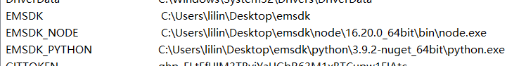
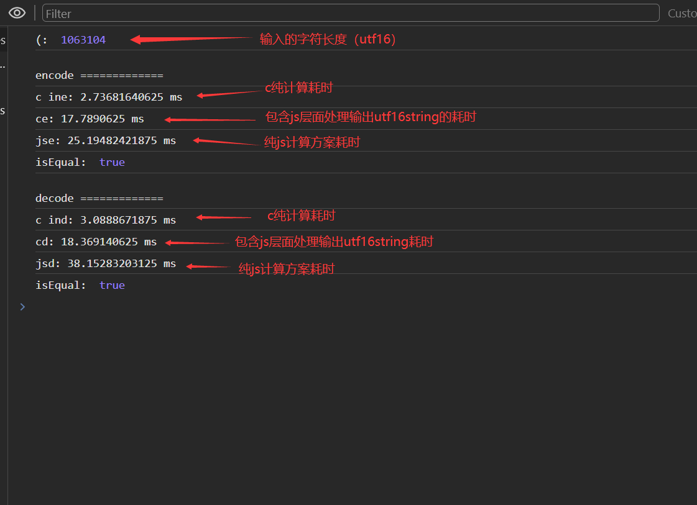

# 使用WebAssembly加速web应用   

WebAssembly很多资料简称wasm，是一种可以将其他语言编译为类汇编的技术，可以在浏览器、nodejs、wasm虚拟机中运行。  

WebAssembly支持c/c++、Rust、go、AssemblyScript等语言来编写。   

> 💡 AssemblyScripit与typescript神似，盲猜应该上手难度不高。    

实测在浏览器中运行的速度比js快很多倍，但是js层面的内存读写，字符编码转换等操作还是会一定层度抵消其速度优势，需要自己来判断必要性；个人认为大量的计算可以尝试采用webAssembly。            

本篇将选择使用c语言编写base64编解码来做测试。   

> ❓ 为什么不是斐波拉契之类的算法来举例？     
> 因为我很久之前在项目中写过base64的polyfill，这里正好拿来对比一下。              

## 环境安装配置     
总体参照MDN、emscripten的问的手册来进行安装。   
 
参考文档： 
* MDN https://developer.mozilla.org/zh-CN/docs/WebAssembly/C_to_wasm   
* emscripten https://emscripten.org/docs/getting_started/downloads.html      

这里以 `windows平台`、`emsdk3.1.51` 为例简要说明一下步骤和坑。   

依赖/环境要求：     
* cmake   
* git   
* Visual Studio Community      
* python2.7 ！实测3.x会出现SSL/TLS相关报错。   

安装步骤：     
1. 克隆emsdk仓库，https://github.com/emscripten-core/emsdk。      
2. 切换到克隆的仓库目录，执行 `emsdk install lastest`。    
3. 执行 `emsdk activate latest`  ！实测该步是部署相关的环境变量。    

>  💡 盲猜随着emsdk的新版本升级，可能会出现安装步骤、所遇到的坑都不一样的情况，建议还是多看官方的手册，或者google相关问题。    

遇到的坑:    
* 在安装步骤第二步，可能会遇到报 python TLS/SSL 相关报错，实测把python换为2.7版本即可解决（我实测时我本机所用3.x版本）。       

* 在安装步骤第3步，可能会执行完命令后遇到环境变量不生效的问题，我这里直接把第三部所需的环境变量手动部署解决，所需的环境变量在下列图片中列出： 
    1. 需要手动添加到Path的地址：   
      
    2. 需要手动部署的环境变量：   
        
 
## 关于base64编码   
base64编码就是一种编码方式，它把二进制以指定的字符来表示，   

>💡 base64不是什么加密巴拉巴的东西，我刚入行的时候看到有些资料把它跟加密字眼相挂钩。   

可能有的人可能会疑惑，js中字符串也能用base64来表示啊（转换为base64），那是因为字符串他的底层也是二进制表示，用某某字符集以及某某编码方式来存储为二进制的， 比如js中的字符也就是UVString底层使用unicode字符集，采用UTF16编码方式表示的（也有看到资料说早期是ucs2，ucs2没有代理区且为定长编码）。    

base64有一个编码表（姑且这么叫他）内部存储了对应的字符以及他的code, 编码、解码都依赖它；这些字符为64个，应该这就是它叫base64的原因； 可能有人会说还有=号呢，加上等号等于65个，这个下面会说明。       

base64编码时把输入的二进制以3个byte为一组，分别以6bit分为4份，每一份code对应去编码表中查找对应的字符成为编码的结果。   

如果输入的二进制byte数量不是3的整数倍，那么最后的哪一队本应为3个byte的字节块，将使用等号补足缺失的多少个base64字符。     

>  💡 base64编码中结尾的=号可选，但是最多只能有2个；就算编码的时候后面需要补充=号，那么你不去补充它也不会影响编码本身，解码的时候也用不到。     

解码就是编码的逆运算，直接拿字符去换取编码表中的code，4个为一组拼为3byte （4个 * 6bit = 24bit， 24bit / 8 = 3byte），依次循环，最后得出编码前的二进制。   

到了这里，应该就明白为什么base64会大33%的原因了。   

## c语言base64编解码   
这里我采用纯wasm不带胶水代码的方式，比使用胶水代码的方式稍微麻烦，不能用标准库的函数，实测我用了会在js层面报improtObject相关错误（也可能是我的姿势不正确）。      

> 一般线上肯定会选择胶水代码 + wasm的方式，省心省事；老板叫你调包出活，结果你折腾通信都要搞半天还出bug，老板以为你在划水，背后将你坏话说你不人认真，提高了老板心中的辞退优先级排名。            
但是不使用胶水代码，可以让你更了解背后的通信方式以及原理。     

除了实现base64的算法，还要自己实现内存管理（内存的申请释放，就是内存块的使用标记，避免多次调用污  染导致数据出错）。       
> 使用胶水代码+wasm的方式就不用自己搞内存管理，直接调api就行了。   

WebAssembly中，数值类型是可以直接传递进行通信的，其他数据类型需要自己向共享内存（官方称为线性内存）中读写数据，传递指针（内存地址）来交互。       

c代码实现：   

*内存管理部分代码*
```c
#include <stdio.h>
#ifdef __EMSCRIPTEN__   
    #include <emscripten.h>
#endif

enum MEM_ERROR_ENUM {
    MALLOC_BLOCK_OVERFLOW = -1,
    MALLOC_SIZE_OVERFLOW = -2,
    MALLOC_SIZE_OVERFLOW_LAST = -3,
    FREE_NOT_FOUND = -4,
};

#define BLOCK_COUNT 20 // 内存分块数
unsigned int MEMORY_SIZE = 655360;  
int current_count = 0;
typedef struct {
    int start;
    int length;
} Node;
Node mem_blocks[BLOCK_COUNT];

static void _resetMemory (int start, int size)
{
    int end = start + size;
    while (start < end) {
        *((unsigned char*)start) = 0;
        start++;
    }
}

EMSCRIPTEN_KEEPALIVE
int _malloc (int size)
{
    int used_mem_len = 0;
    for (int i = 0; i < current_count; i++) {
        used_mem_len += mem_blocks[i].length;
    }
    if (used_mem_len >= MEMORY_SIZE) {
        return MALLOC_SIZE_OVERFLOW;
    }
    if (current_count >= BLOCK_COUNT) {
        return MALLOC_BLOCK_OVERFLOW;
    }
    while (size % 8) size++;
    Node* prevNode = NULL;
    Node* nowNode = NULL;
    // 间隙插入
    for (int i = 0; i < current_count; i++) {
        if (prevNode == NULL) {
            prevNode = &mem_blocks[i];
            continue;
        }
        nowNode = &mem_blocks[i];
        int maybeStart = prevNode->start + prevNode->length;
        int space = nowNode->start - maybeStart;
        if (space < size) {
            prevNode = nowNode;
            continue;
        }
        _resetMemory(maybeStart, size);
        Node node = {
            .start = maybeStart,
            .length = size,
        };
        for (int j = current_count; j > i; j--) {
            mem_blocks[j] = mem_blocks[j - 1];
        }
        current_count++;
        mem_blocks[i] = node;
        prevNode = NULL;
        nowNode = NULL;
        return maybeStart;
    }
    // 尾部插入
    // 资料建议要把前面一部分内存预留出来，避开他，不要使用；说是c代码中的字面量（常量）会放在靠前的内存里。   
    int start;
    if (prevNode == NULL) {
        start = 2048;
    } else {
        start = prevNode -> start + prevNode -> length;
    }
    if (start + size > MEMORY_SIZE) {
        return MALLOC_SIZE_OVERFLOW_LAST;
    }
    _resetMemory(start, size);
    Node node = {
        .start = start,
        .length = size,
    };
    mem_blocks[current_count] = node;
    current_count++;
    return start;
}

EMSCRIPTEN_KEEPALIVE
int _free (int point) 
{  // TODO ！释放有bug，会导致申请的指针一直往后跑前面申请后释放的的不会复用，懒得JB修    
    int find_node_index = -1;
    for (int i = 0; i < current_count; i++) {
        if (mem_blocks[i].start != point) continue;
        find_node_index = i;
        break;
    }
    if (find_node_index == -1) {
        return -1;
    }
    for (int i = find_node_index; i < current_count; i++) {
        mem_blocks[i] = mem_blocks[i + 1];
    }
    current_count--;
    return 0;
}


static int _strlen (char* str) 
{
    char* s = str;
    int l = 0;
    while (*(s++) != 0) l++;
    return l;
}
``` 
*base64编解码部分代码*      
```c
#include "string.h"
#include "wasm.h"
#define MAGICK_STR "ABCDEFGHIJKLMNOPQRSTUVWXYZabcdefghijklmnopqrstuvwxyz0123456789+/"

static unsigned char* magick_str = (unsigned char*)MAGICK_STR;

// 直接能装下整个ascii（包括eascii）
static unsigned char reverse_map[255];

static int _prehandle_reverse_map_inited = 0;
static void prehandle_reverse_map () 
{
    if (_prehandle_reverse_map_inited) return;
    _prehandle_reverse_map_inited = 1;
    for (int i = 0; i < _strlen(magick_str); i++)
    {
        reverse_map[magick_str[i]] = i;
    }
}

void (*base64_prehandle_reverse_map)(void) = &prehandle_reverse_map;

EXPORT_FUNC
unsigned int base64_encode (unsigned char* bytes, unsigned int byteLen, unsigned char* dest) 
{
    unsigned long i = 0;
    unsigned long j = 0;

    while (i < byteLen) {;
        unsigned long left = byteLen - i;
        unsigned int a, b, c, d;
        
        // 末尾只剩2byte
        if (left == 2) 
        {
            a = bytes[i] >> 2;
            b = ((bytes[i] & 0x03) << 4) | (bytes[i + 1] >> 4);
            c = (bytes[i + 1] & 0x0f) << 2;

            dest[j++] = magick_str[a];
            dest[j++] = magick_str[b];
            dest[j++] = magick_str[c];
            dest[j++] = '=';
            dest[j] = '\0';
        }
        // 末尾只剩1byte
        else if (left == 1) 
        {
            a = bytes[i] >> 2;
            b = (bytes[i] & 0x03) << 4;

            dest[j++] = magick_str[a];
            dest[j++] = magick_str[b];
            dest[j++] = '=';
            dest[j++] = '=';
            dest[j] = '\0';
        }
        // 足byte
        else 
        {
            a = bytes[i] >> 2;
            b = ((bytes[i] & 0x03) << 4) | (bytes[i + 1] >> 4);
            c = ((bytes[i + 1] & 0x0f) << 2) | (bytes[i + 2] >> 6);
            d = bytes[i + 2] & 0x3f;

            dest[j++] = magick_str[a];
            dest[j++] = magick_str[b];
            dest[j++] = magick_str[c];
            dest[j++] = magick_str[d];
            if (left == 3) 
            {
                dest[j] = '\0';
            }
        }
        i += 3;
    }

    return j;
}

EXPORT_FUNC
unsigned int base64_decode (unsigned char* bytes, unsigned int byteLen, char* dest)
{
    prehandle_reverse_map();
    unsigned long i = 0;
    unsigned long j = 0;
   
    // 数量一定是4的整数倍
    // 这里暂时不考虑刻意省略pad
    while (i < byteLen) 
    {
        char a = reverse_map[bytes[i++]];
        char b = reverse_map[bytes[i++]];
        char c = -1;
        char d = -1;
        
        if (bytes[i] != '=') 
            c = reverse_map[bytes[i++]];
        else 
            i++;
        if (bytes[i] != '=')
            d = reverse_map[bytes[i++]];
        else
            i++;
        
        // byte 1
        dest[j++] = (a << 2) | ((b >> 4) & 0x03);

        if (c != -1) 
            // byte 2
            dest[j++] = ((b & 0x0f) << 4) | ((c >> 2) & 0x0f);
        if (d != -1)
            // byte 3
            dest[j++] = ((c & 0x03) << 6) | (d & 0x3f);
    }

    dest[j] = '\0';

    return j;
}
```

以上代码并未全部列出，只列出主要代码。        

编译的话就执行命令就好了，如果自己项目用，可以自己写构建脚本，可以转为js文件直接随着胶水代码一起加载了。   

我这里用到的编译命令及参数如下：   
`emcc ./src/base64.c ./src/string.c ./src/memory.c -O${O} -s STANDALONE_WASM --no-entry -s TOTAL_MEMORY=${MEMORY} -o ./dist/${WASM_FILE_NAME}`   

> 💡 因为我自己在打包脚本中调用编译命令，部分参数使用了环境变量插值。

相关命令以及参数，参考emscripten官方手册，很容易忘的。     
      

## 浏览器调用部分代码编写   
浏览器部分由于没有使用胶水代码+wasm的方式，需要自己实现一部分胶水代码的功能。       

使用浏览器宿主api WebAssembly来实例化（或者叫编译）加载好的wasm文件，然后就可以调用c的函数了，   
还是那句话除了数值类型可以直传交互，其他类型都需要内存交互，这就会用到上面c中实现的内存管理函数了。    

浏览器部分代码：   


*胶水代码部分*   
```js
// 这里为了偷懒，我在打包工具链中将打包后的wasm文件转为了js，这里直接引入就行了。   
// 具体是使用加载wasm文件，还是打包到js文件，还是那句话看取舍，c打包的wasm启用优化的话一般比较小。   
import wasm_bytes from "./wasm-bytes.js";

class _Descriptor {
    constructor (...args) {
        const { FIELDS } = new.target;
        return FIELDS.reduce((r, f, i) => {
            Object.defineProperty(r, f, {
                writable: false,
                enumerable: false,
                configurable: false,
                value: args[i],
            });
            return r;
        }, Object.create(null));
    }
}

export class ResultDescriptor extends _Descriptor {
    static FIELDS = [
        "buffer",
        "string",
    ];
}

export default async function () {
    // 加载编译的wasm文件   
    const fetch_res = await fetch("xxx.wasm");
    const wasm_bytes =  await fetch_res.arrayBUffer();

    // wasm实例化   
    const { instance: { exports: mod } } = await WebAssembly.instantiate(new Uint8Array(wasm_bytes));
    return { encode, decode };

    /**
     * 编码
     * 
     * @param {ArrayBuffer | string} source 
     * @return {ResultDescriptor}
     */
    function encode (source) {
        const [ u8, byteLen, in_point, out_point ] = _prehandle(mod, source);
        new Uint8Array(mod.memory.buffer).set(u8, in_point);
        __BASE64CODEC_WASM_DEBUG__ && console.time("c ine");
        const en_len = mod.base64_encode(in_point, byteLen, out_point);
        __BASE64CODEC_WASM_DEBUG__ && console.timeEnd("c ine");
        const resUi8 = new Uint8Array(mod.memory.buffer, out_point, en_len);
        mod.releaseMemory(in_point);
        mod.releaseMemory(out_point);
        return new ResultDescriptor(
            resUi8,
            new TextDecoder().decode(resUi8),
        );
    }

    /**
     * 解码 
     * 
     * @param {ArrayBuffer | string} source
     * @return {ResultDescriptor}
     */
    function decode (source) {
        const [ u8, byteLen, in_point, out_point ] = _prehandle(mod, source);
        new Uint8Array(mod.memory.buffer).set(u8, in_point);
        __BASE64CODEC_WASM_DEBUG__ && console.time("c ind");
        const de_len = mod.base64_decode(in_point, byteLen, out_point);
        __BASE64CODEC_WASM_DEBUG__ && console.timeEnd("c ind");
        const resUi8 = new Uint8Array(mod.memory.buffer, out_point, de_len);
        mod.releaseMemory(in_point);
        mod.releaseMemory(out_point);
        return new ResultDescriptor(
            resUi8,
            new TextDecoder().decode(resUi8),
        );
    }
}

function _prehandle (mod, source) {
    const u8 = _bytes(source);
    const byteLen = u8.byteLength;
    const 
        in_point = mod.requestMemory(byteLen),
        out_point = mod.requestMemory(byteLen);

    if ([ in_point, out_point ].some(i => i < 0)) {
        throw "): wasm 层面内存申请出错！";
    }

    return [ u8, byteLen, in_point, out_point ];
}

function _bytes (source) {
    try {
        return ({
            "[object Uint8Array]": () => source,
            "[object String]": () => new TextEncoder().encode(source),
        })[{}.toString.call(source)]();
    } catch {
        throw `): source 类型错误!`;
    }
}
```

*浏览器调用部分（业务层）*      
```html
<!DOCTYPE html>
<html lang="zh">
<head>
    <meta charset="UTF-8">
    <meta name="viewport" content="width=device-width, initial-scale=1.0">
    <title>Document</title>
</head>
<body>
    wasm.html
    <hr/>
    <!-- <input type="file" /> -->
    <textarea style="height: 500px; width: 70%;"></textarea>
    <hr/>
    <button>test</button>
</body>
<script>
// 胶水代码调试flag  
__BASE64CODEC_WASM_DEBUG__ = true;
</script>
<!-- 用于对比的js base64方案 -->  
<script src="https://cdn.jsdelivr.net/npm/js-base64@3.7.5/base64.min.js"></script>

<!-- 调用 -->
<script type="module">
import base64wasm_init from "../dist/index.js";

// 初始化，拿到闭包中的方法，闭包持有wams实例  
const { encode, decode } = await base64wasm_init();

document.querySelector("button").onclick = async () => {

    const str = document.querySelector("textarea").value || "";

    console.log("(: ", str.length);

    console.log("\nencode =============");

    console.time("ce");
    const en = encode(str);
    console.timeEnd("ce");
    // console.log(en.string);


    console.time("jse");
    const jsen = Base64.encode(str);
    console.timeEnd("jse");
    // console.log(jsen);

    console.log("isEqual: ", en.string === jsen);

    console.log("\ndecode =============");

    console.time("cd");
    const de = decode(en.string);
    console.timeEnd("cd");
    // console.log(de);

    console.time("jsd");
    const jsde = Base64.decode(jsen);
    console.timeEnd("jsd");
    // console.log(jsde);

    console.log("isEqual: ", de.string === jsde);
}
</script>
</html>
```


## 测试结果    
嗯，视乎不太理想，纯c计算部分倒是蛮快的，至少《遥遥领先》5-7倍乃至更多，但是内存读写，字符集编码转换会消耗掉不少时间。       

实测结果截图：    
    

在大量数据面前，就是数据够大的情况还是有优势的，数据少量的话，一套下来能持平乃至劣势。     
纯c部分不管是数据量大还是小，都挺快的。   
就那句话，数据量少直接js，量大再考虑wasm，在某些计算密集型应用还是有优势的。    

> 💡 本篇举例的base64大量数据的应用场景几乎没什么实际意义，只是测试举例用；大的数据量用base64有什么意思。        

## 结语  

个人WebAssembly方案用来测试实践加速大文件上传中的hash计算、部分加密相关场景（感觉前端加密貌似是个伪需求，虽说wasm也是迎合web开放特性，wasm在调试器中表示为S-表达式，但是相比传统js混淆的方案 wasm可能？会提升一定的逆向成本）。   

base64的编码表可以自己替换为自定义的字符，来实现简单的对称加密，（实际没什么意义）。    

本篇中所讲项目中实现base64 polyfill代码见此： https://github.com/lilindog/base64-helper
